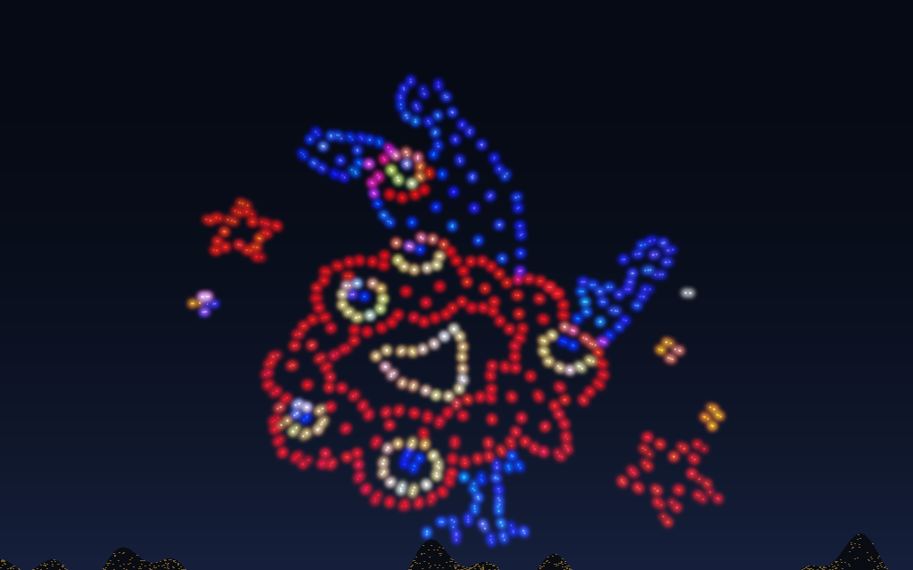

# drone_emu_cpp

ドローンショーシミュレータ。**写真や絵から光点を拾って、そこへドローンを飛ばします。**
計算も描画もすべて C++、Emscripten で WASM にして走らせます。作りは
[hanabi_emu_cpp](https://github.com/yomei-o/hanabi_emu_cpp) /
[suisou_emu_cpp](https://github.com/yomei-o/suisou_emu_cpp) と同じ ABI・同じハーネス。

## ▶ WASM デモ

### **https://yomei-o.github.io/drone_emu_cpp/wasmdist/drone_os/**

**🖼 写真1 の絵** / **🥤 写真2 の絵** / **🐱 ドラえもん** / **🔵 球** / **⭕ 輪** ボタンで編隊が切り替わり、
全機が同じ所要時間 T を共有して**同時に到着**します。**🛬 着陸**で降ろせます。
実測の最大速度・最大加速度・最接近距離は画面下に出ます。
**⛶ 全画面**（または **F** キー）で文字を全部消してドローンだけの全画面に。



## 何をシミュレーションしているか

本物のドローンショーの「あのゆったりした動き」と「全機がピタッと同時に揃う」感じは、
演出ではなく**制約**から出てきます。

### 1. 最小ジャーク軌道
両端で速度も加速度もゼロになる軌道を使います（機体に無理をさせない標準的なやり方）。

```
s(τ) = 10τ³ − 15τ⁴ + 6τ⁵            (τ = t/T)
v_max = 1.875 d / T,  a_max = 5.7735 d / T²
```

**最大速度と最大加速度が、距離 d と所要時間 T だけで決まります。**

### 2. 全機同時到着
T を「いちばん遠い機体が速度と加速度の上限を守れる最小値」に取り、**全機がその同じ T を共有**します。
だから近い機体はゆっくり動き、全員が同時に到着する。振り付けたのではなく、制約から出てきます。

機体の性能は実機に合わせて 最大 6 m/s / 3.5 m/s² / 最小間隔 2m。
実測値は画面下に出ます（速度は上限に張り付き、加速度にはまだ余裕がある、という実機と同じ状況が読めます）。

### 3. 割り当て
どの機体がどの点へ行くかを、総移動距離が短くなるよう交換で改善します。
軌跡が交差しにくくなり、実際の運用と同じく衝突が起きにくくなります。

### 4. 編隊の大きさ
長辺を基準に揃えると、画面が横長なので**横長の絵だけ小さく見えます**。
画面の横と縦の両方に収まる倍率のうち小さいほうを使い、縦の中心はカメラが向いている高さに合わせます
（固定値にすると縦長の絵が上に見切れます）。
外接矩形は外れ値ひとつで広がるので、上下1%を切った範囲で見ています。

### 5. 定点保持のゆらぎ
ばね＋減衰＋風の外乱。実機は RTK-GPS でも常に数十cm揺れています。

## 写真から光点を拾う（tools/mkpoints.cpp）

ハマりどころが3つありました。

**青が落ちる。** 検出に輝度 `R×0.30 + G×0.59 + B×0.11` を使うと、
**青の寄与が 11% しかない**ので純青の LED を取りこぼします。`max(R,G,B)` で見ます。

**空の色がにじみに乗る。** 薄暮の写真だと青い空の色が LED のにじみに混ざり、
彩度を上げると白い LED まで青くなります（実際「オロナミンCの瓶に青321機」という結果が出ました）。
**局所背景の RGB を引いて「LED が足した分」**だけを見ます。これで夜空でも薄暮でも同じ設定で拾えます。

**隣の LED がくっつく。** しきい値を下げると連結成分がひとつの塊になります。
連結成分ではなく**極大点**を取り、最小間隔は孤立した小さい塊の大きさから見積もります。

**地平線の雲や観客のスマホを拾う。** これらは密集しているので「孤立点を捨てる」だけでは残り、
外接矩形を広げて本体を小さくしてしまいます。点を塊にまとめ、**本体から離れた塊ごと捨てます**。
繋ぐ距離が狭いと絵の中の飛び石模様まで別の塊になるので、最小間隔の6倍で繋いでいます。
本体の近く(外接矩形から12%以内)の小さな塊は、飾りとみなして残します。

```sh
./mkpoints assets/show.png  src/show_pts.h  /tmp/a.png 0.655 SHOW    # 夜空
./mkpoints assets/show2.png src/show2_pts.h /tmp/b.png 0.80  SHOW2   # 薄暮
#          入力             出力ヘッダ       確認用     空の割合 シンボル名
```

## ふつうの絵から編隊を作る（tools/mkart.cpp）

輪郭を拾って、等間隔に機体を置きます。ここに物理的な制約がひとつ。

**ドローンは黒を描けません。** 光を出すものなので、黒い輪郭線は「機体がいない場所」にしかならない。
なので線の位置には**隣接する面の色**を置きます。そのために、色を拾う窓から黒い主線を除外し、
さらに**背景の白も除外**します（外周から塗りつぶして背景を特定する。これをやらないと
外側の輪郭が背景の白に引っ張られて全部白くなります）。

```sh
./mkart doraemon.jpg src/art_pts.h /tmp/art.png 600 ART
```

`src/art_pts.h` が無いときは、その編隊だけ無効になってビルドは通ります（`__has_include`）。

## ビルド

```sh
EMSDK=~/emsdk ./build.sh drone_os     # -> wasmdist/drone_os/sim.js (+.wasm)
cd wasmdist && python3 -m http.server 8000

clang++ -O2 -std=c++17 -I. -Isrc src/drone_os.cpp -o drone
./drone 3200 preview.png 0 2          # フレーム数 出力 HUD 編隊(0写真1 1写真2 2絵 3球 4輪)
```

## 素材

`assets/` と `doraemon.jpg` は動作確認のために置いてあります。
**出典・ライセンスは未確認**なので、再配布や商用利用の際はご自身で確認してください。
`tools/` は任意の画像で動くので、手元の素材に差し替えられます。

## ABI

`sim_init / sim_w / sim_h / sim_reset / sim_step / sim_render / sim_click / sim_set / sim_action` ＋ `sim_get(id)`。

- `sim_set`: 0時間の進み 1光の強さ 2HUD 3自動切替
- `sim_get`: 0機数 1実測vmax 2実測amax 3最接近距離 4編隊 5所要時間T 6進捗
- `sim_action`: 0写真1 1写真2 2絵 3球 4輪 5着陸 6リセット
